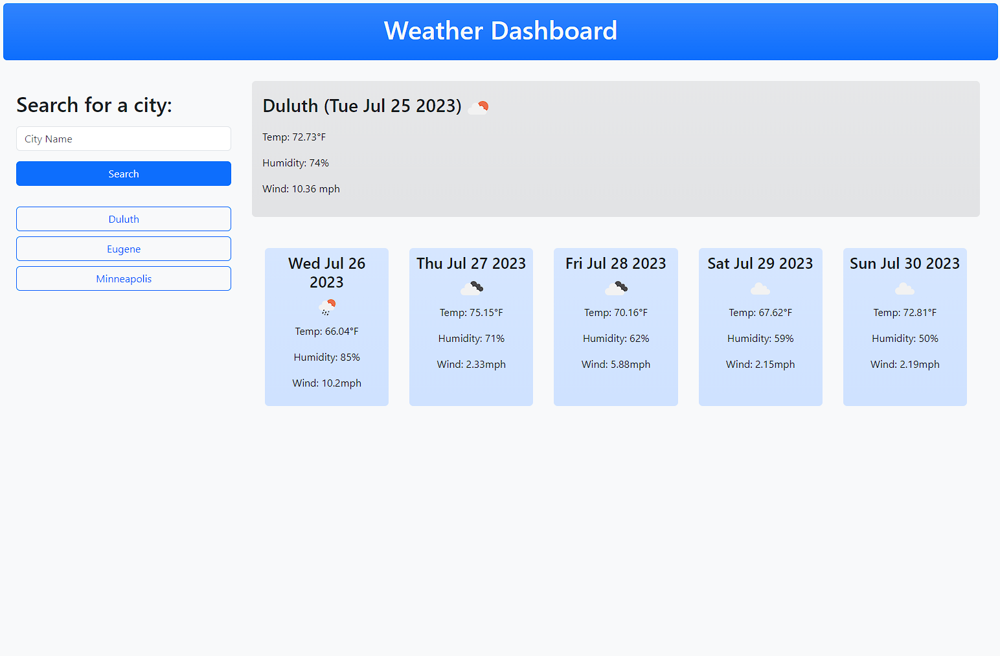

# Weather Dashboard

## Description
The weather dashboard allows users to search and save current weather, as well as a five day forecast, for multiple cities.

## Installation
N/A

## Usage
Deployment: https://elthell.github.io/weather-dashboard/;

Preview:

## Credits
Timestamp conversion: https://timestamp.online/article/how-to-convert-timestamp-to-datetime-in-javascript;

## License
N/A